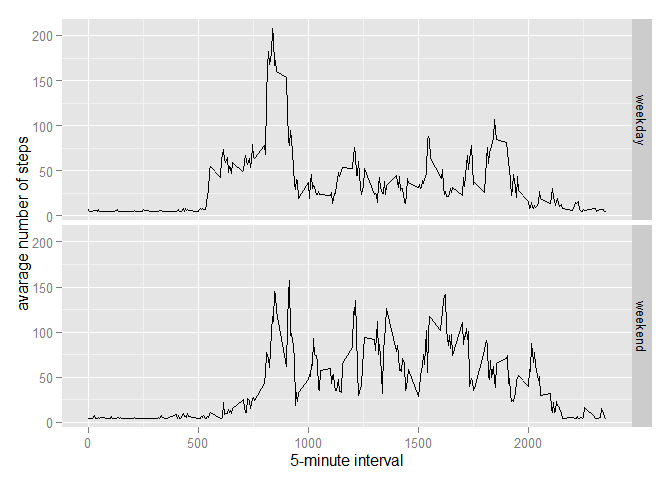

# Reproducible Research: Peer Assessment 1


```r
library(ggplot2)
library(scales)
library(Hmisc)  
```

```
## Loading required package: grid
## Loading required package: lattice
## Loading required package: survival
## Loading required package: Formula
## 
## Attaching package: 'Hmisc'
## 
## The following objects are masked from 'package:base':
## 
##     format.pval, round.POSIXt, trunc.POSIXt, units
```


---

#### Loading and preprocessing the data


First check to make sure file isn't already unzipped.  If it isn't, then unzip.  
If it is, read it in.


```r
if(!file.exists('activity.csv')){
    unzip('activity.zip')
}

dat = read.csv('activity.csv', header = T)
```


#### Processing / transforming the data into something usable for our purposes.


```r
#dat$interval <- strptime(gsub("([0-9]{1,2})([0-9]{2})", "\\1:\\2", dat$interval), format='%H:%M')
```


#### What is mean total number of steps taken per day?


```r
stepsByDay <- tapply(dat$steps, dat$date, sum, na.rm=TRUE)
```


#### 1. Make a Histogram of the total number of steps taken each day


```r
qplot(stepsByDay, xlab='Total steps per day', ylab='Frequency using binwith 500', binwidth=750)
```

 


#### 2. Calculate and report the mean and median total number of steps taken per day.


```r
stepsByDayMean <- mean(stepsByDay)
stepsByDayMedian <- median(stepsByDay)
```

* Mean: 9354.2295082
* Median:  10395


---


#### What is the average daily activity pattern?


```r
averageStepsPerInt <- aggregate(x=list(meanSteps=dat$steps), by=list(interval=dat$interval), FUN=mean, na.rm=TRUE)
```

#### 1. Make a time series plot


```r
ggplot(data=averageStepsPerInt, aes(x=interval, y=meanSteps)) + geom_line() + 
        xlab("5-minute interval") + ylab("average number of steps taken") 
```

 


#### 2. Which 5-minute interval, on average across all the daays in the dataset, contains the 
#### maximum number of steps?


```r
maxSteps <- which.max(averageStepsPerInt$meanSteps)
timeMaxSteps <-  gsub("([0-9]{1,2})([0-9]{2})", 
                      "\\1:\\2",averageStepsPerInt[maxSteps,'interval'])
```

* Max steps are at: 8:35


---


### Imputing missing values


#### 1. Calculate and report the total number of missing values in the dataset.


```r
totMissingValues <- length(which(is.na(dat$steps)))
```

* Total number of missing values: 'r totMissingValues'


#### 2. Devise a strategy for filling in all of the missing values in the dataset.

Using the impute() function from the Hmisc library, the new dataset, datImputed, 
had all missing values for steps replaced with the mean of the value.


```r
datImputed <- dat
datImputed$steps <- impute(dat$steps, fun=mean)
```


#### 4. Make a histogram of the total number of steps taken each day and Calculate
####        and report the mean and median total number of steps taken per day.
        

```r
stepsByDayImputed <- tapply(datImputed$steps, datImputed$date, sum)
qplot(stepsByDayImputed, xlab='Total steps per day (Imputed)',
      ylab='Frequency using binwith 750', binwidth=750)
```

 

```r
stepsByDayMeanImputed <- mean(stepsByDayImputed)
stepsByDayMedianImputed <- median(stepsByDayImputed)
```


##### Reporting Mean and Median for the new steps per day data.

* Mean (Imputed): 1.0766189\times 10^{4}
* Median (Imputed):  1.0766189\times 10^{4}


####Do these values differ from the estimates from the first part of the assignment? 

Yes, they differ from the original values quite significantly.

#### What is the impact of imputing missing data on the estimates of the daily number of steps?
Filing in the missing data, increasing both the mean and median value.         


---


#### Are there differences in activity patterns between weekdays and weekends?


#### 1. Create a new factor variable in the dataset with two levels - "weekday" and "weekend" indicating whether a given date is a weekday or weekend day.


```r
datImputed$dateType <-  ifelse(as.POSIXlt(datImputed$date)$wday %in% c(0,6), 'weekend', 'weekday')
```


#### 2. Make a panel plot containing a time series plot.


```r
averagedDatImputed <- aggregate(steps ~ interval + dateType, data=datImputed,mean)
ggplot(averagedDatImputed, aes(interval, steps)) + geom_line() + 
        facet_grid(dateType ~ .) +
        xlab("5-minute interval") +  ylab("avarage number of steps")
```

 
